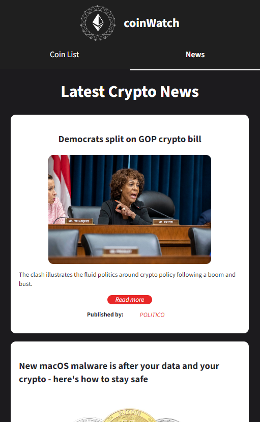

# Coin Watch

A fully-responsive website that displays real time cryptocurrency data provided by the Coin Gecko API. The application can show price changes over time, a description of each asset, and also show the latest crypto news gathered from GNews.
The main purpose of this project was to implement a Redux store that could fetch data from the API, and use that data in the react components.

#### Disclaimer

Since both APIs used for the project are on free plans, there might be scenaros in which the application won't fetch data due to request limits.

## Tech Stack

**Website:** React, Redux, Sass, Axios, Chart.js.

**Tools:** Vite, Vercel.

## Live Site

https://coin-watch-r10bn6i04-juanfec4.vercel.app/

## Design choices

Throughout this project I faced several challenges. The first version I made I tried to use the context API from react. However that did not work well when trying to update states from child components. So I decided to split the states from my components, and thus I utilized React-redux, which allowed me to create a store to act as a 'database' that could be updated via actions. The components were then subscribed to the values from the store enabling a simple flow of information from a central point to the rest of the application once fetched.

#### Video Demo: https://www.youtube.com/watch?v=gYJKWHD1tp0

## Screenshots

#### Displays a list of crypto currencies (default state).

#### Filters and search params.

#### Currency page (using chart.js).

#### Dynamic description powered by CoinGecko API.

#### Latest news page.

#### Fully responsive pages.

## GEEK STUFF (CS50)

This project utilizes react as a front-end library, meaning components are dynamically added to the page. Components are created based on data fetched from external resources via their API. To make things simpler, I used Axios to make API calls. These are contained within the services folder. The calls are only made occasionally to avoid reaching the API call limits provided by free plans. The data is stored using React-redux, which is a state management library that lets us create a store with different actions within that each dispatch a change to the store's state (aka. value). The components are subscribed to those changes and also get methods to update the state in the event that a loading, filter, or search takes place. The other key aspect of the project was using React router to create different pages depending on what the user clicks. This was especially useful when making each coin page, as the basic structure was the same, but the information could dynamically change, the route had to also change.

Why React?

I wanted to use a framework that could make the programming experience more modular and effective. React was a simple-to-grasp concept once I learned enough JavaScript.

Why Redux?

To be honest, I wanted to challenge myself, there are more straightforward state management techniques, but I really wanted to learn a new technology.

Why Sass and not CSS?

I like to use BEM to create reusable CSS; this is best paired with Scss (Sass), because I can nest items and follow the flow of the HTML document (JSX).

What could I improve?

I definitely could add more functionalities to the project. The idea is to evolve the project as I learn more, and I could even add my own REST API to store user authentication and watch-list coins that each user picks. I plan to use and modify this project as I progress through my coding journey.
