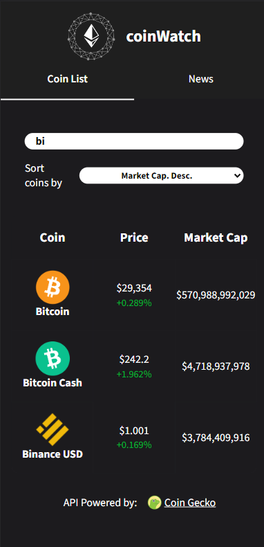

# Coin Watch

A fully-responsive website that displays real time cryptocurrency data provided by the Coin Gecko API. The application can show price changes over time, a description of each asset, and also show the latest crypto news gathered from GNews.
The main purpose of this project was to implement a Redux store that could fetch data from the API, and use that data in the react components.

#### Disclaimer

Since both APIs used for the project are on free plans, there might be scenaros in which the application won't fetch data due to request limits.

## Tech Stack

**Website:** React, Redux, Sass, Axios, Chart.js.

**Tools:** Vite, Vercel.

## Live Site

https://coin-watch-r10bn6i04-juanfec4.vercel.app/

## Screenshots

#### Displays a list of crypto currencies (default state).

#### Filters and search params.

#### Currency page (using chart.js).

#### Dynamic description powered by CoinGecko API.

#### Latest news page.

#### Fully responsive pages.

